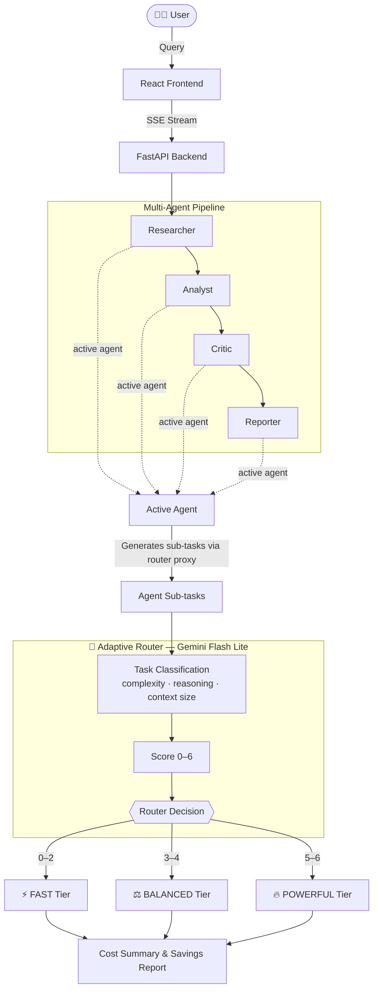

# 🧭 Adaptive Agent Model Router

> A multi-agent pipeline routing engine that dynamically selects the cheapest LLM capable of handling each sub-task — cutting inference costs without sacrificing output quality.

[](https://www.python.org/)
[](https://fastapi.tiangolo.com/)
[](https://react.dev/)
[](https://ai.google.dev/)

---

## ✨ Features

| Feature                                | Description                                                                                                     |
| -------------------------------------- | --------------------------------------------------------------------------------------------------------------- |
| 🧠**Adaptive Routing**           | Classifies each agent sub-task on complexity, reasoning, and context size to select the right model tier        |
| 💸**Cost Comparison**            | Side-by-side breakdown of Adaptive vs All-Fast / All-Balanced / All-Powerful static strategies                  |
| 📊**Live Pipeline Visualizer**   | Streams the full 4-agent pipeline (Researcher → Analyst → Critic → Reporter) in real time                    |
| 🔬**Routing Playground**         | Isolate any single agent and explore how it would be routed for any task                                        |
| ⚡**Result Caching**             | Previous runs are cached in`localStorage` and restored instantly on re-selection                              |
| 🎯**Realistic Token Estimation** | Context accumulation mirrors real pipeline semantics — each downstream agent inherits the prior agents' output |

---

## 🛠️ Tech Stack

- **Routing & Classification LLM**: **Gemini 3.1 Flash Lite** (via `google-genai`) — fast and cheap; used only for classifying sub-tasks, not executing them
- **Backend**: **FastAPI** (Python 3.11+) with SSE streaming for real-time pipeline updates
- **Frontend**: **React + Vite** (TypeScript) with Recharts for cost visualizations
- **Token counting**: `tiktoken` (o200k_base encoding)

---

## 🏗️ Architecture



---

## 📐 How the Router Score Works

For every generated sub-task, the router assesses three dimensions and scores each from 0–2:

$$
\text{Routing Score} = \text{Complexity} + \text{Reasoning} + \text{Context Size}
$$

| Metric               | Score 0     | Score 1       | Score 2     |
| :------------------- | :---------- | :------------ | :---------- |
| **Complexity** | Low         | Medium        | High        |
| **Reasoning**  | Low         | Medium        | High        |
| **Context**    | < 2k tokens | 2k–6k tokens | > 6k tokens |

### Tier Thresholds

| Score  | Tier          | Default Model  |
| :----- | :------------ | :------------- |
| 0 – 2 | ⚡ FAST       | `gpt-5-mini` |
| 3 – 4 | ⚖️ BALANCED | `gpt-5`      |
| 5 – 6 | 🔥 POWERFUL   | `gpt-5-pro`  |

---

## 🔁 Realistic Context Accumulation

Token estimation follows real multi-agent pipeline semantics — not a flat guess per step:

| Agent                | Input Context                                                                                     |
| :------------------- | :------------------------------------------------------------------------------------------------ |
| **Researcher** | Each step estimated independently (simulates web searches with variable data sizes)               |
| **Analyst**    | Query + all Researcher output                                                                     |
| **Critic**     | Query + Researcher output + Analyst output                                                        |
| **Reporter**   | Query + Analyst output + Critic output (raw Researcher data dropped — not needed for formatting) |

This means downstream agents naturally receive higher input token counts as context accumulates — matching what you'd see in a real execution pipeline.

---

## 📁 Project Structure

```
.
├── backend/
│   ├── main.py                      # FastAPI app — /api/analyze (SSE), /api/plan-route, /api/plan-route/stream, /api/route
│   ├── requirements.txt
│   ├── .env.example                 # Template — copy to .env and fill in your key
│   ├── config/
│   │   └── settings.py              # Pydantic settings (model names, pricing, API keys)
│   ├── router/
│   │   └── model_router.py          # Core logic — plan generation, classification, scoring, cost
│   └── tests/
│       ├── test_router.py           # Unit tests for router logic (no API key required)
│       └── classifier_test_cases.json
└── frontend/
    └── src/
        ├── components/
        │   ├── PipelineDemo.tsx      # QA tab — full 4-agent pipeline visualizer
        │   └── RouterPlayground.tsx  # Playground tab — single agent explorer
        ├── api/client.ts             # Typed API client with SSE stream handling
        └── utils/runCache.ts         # localStorage result cache
```

---

## 🚀 Quick Start

### Prerequisites

- Python 3.9+
- Node.js 18+
- A [Google AI Studio](https://aistudio.google.com/app/apikey) API key (free tier works)

### 1. Clone & configure

```bash
git clone https://github.com/Proxy-Pointer/Adaptive_Router.git
cd Adaptive_Router
cp backend/.env.example backend/.env
# Edit backend/.env and add your GOOGLE_API_KEY
```

### 2. Start the backend

```bash
cd backend
python -m venv venv

# Windows:
.\venv\Scripts\activate
# macOS/Linux:
source venv/bin/activate

pip install -r requirements.txt
python main.py
# API running at http://localhost:8000
```

### 3. Start the frontend

```bash
cd frontend
npm install
npm run dev
# App running at http://localhost:5173
```

---

## 🔑 Environment Variables

Copy `backend/.env.example` to `backend/.env` and fill in your values:

| Variable                 | Default        | Description                                                        |
| :----------------------- | :------------- | :----------------------------------------------------------------- |
| `GOOGLE_API_KEY`       | *(required)* | Gemini API key — used for plan generation and task classification |
| `FAST_MODEL`           | `gpt-5-mini` | Display label for the fast tier in the UI                          |
| `BALANCED_MODEL`       | `gpt-5`      | Display label for the balanced tier in the UI                      |
| `POWERFUL_MODEL`       | `gpt-5-pro`  | Display label for the powerful tier in the UI                      |
| `FAST_INPUT_COST`      | `0.25`       | USD per 1M input tokens — fast tier                               |
| `FAST_OUTPUT_COST`     | `2.00`       | USD per 1M output tokens — fast tier                              |
| `BALANCED_INPUT_COST`  | `1.25`       | USD per 1M input tokens — balanced tier                           |
| `BALANCED_OUTPUT_COST` | `10.00`      | USD per 1M output tokens — balanced tier                          |
| `POWERFUL_INPUT_COST`  | `15.00`      | USD per 1M input tokens — powerful tier                           |
| `POWERFUL_OUTPUT_COST` | `120.00`     | USD per 1M output tokens — powerful tier                          |
| `MODEL_RETRY_COUNT`    | `1`          | Retries on failed API calls                                        |

> **Note:** Model label names (`FAST_MODEL`, etc.) are purely for display. The actual LLM used for routing classification is always Gemini Flash Lite, set via `GOOGLE_API_KEY`.

---

## 🧪 Running Tests

Tests mock the LLM output and validate routing logic (score calculation, tier thresholds, context sizing) — no API key required.

```bash
cd backend
pytest tests/ -v
```

---

## 💡 Key Design Decisions

**Why classify with a cheap model?**
The classification prompt is simple and structured — complexity/reasoning/context can be reliably extracted by a fast, cheap model. Spending `$0.15/1M` tokens on routing to save `$14.85/1M` on execution is the entire value proposition.

**Why not count actual tokens?**
In a real production pipeline, agents execute tasks and produce real text — you'd measure exact token counts from API responses. This project simulates the *routing decision layer*, demonstrating where and how routing decisions would be made without running the full execution pipeline.

**Why does the Reporter exclude the Researcher's raw data?**
By the time the Reporter runs, the Analyst and Critic have distilled raw findings into structured conclusions. Passing unprocessed search data to a formatting step inflates context costs needlessly.


## Author

**Partha Sarkar**

## Contact

- **GitHub Issues**: For bug reports.
- **General Questions**: For general questions, ideas, and enhancement requests, reach out to me on [LinkedIn](https://www.linkedin.com/in/partha-sarkar-lets-talk-ai) or [Email](mailto:partha.sarkarx@gmail.com).

---

## License

© 2026 Partha Sarkar. Licensed under [MIT](./LICENSE)
